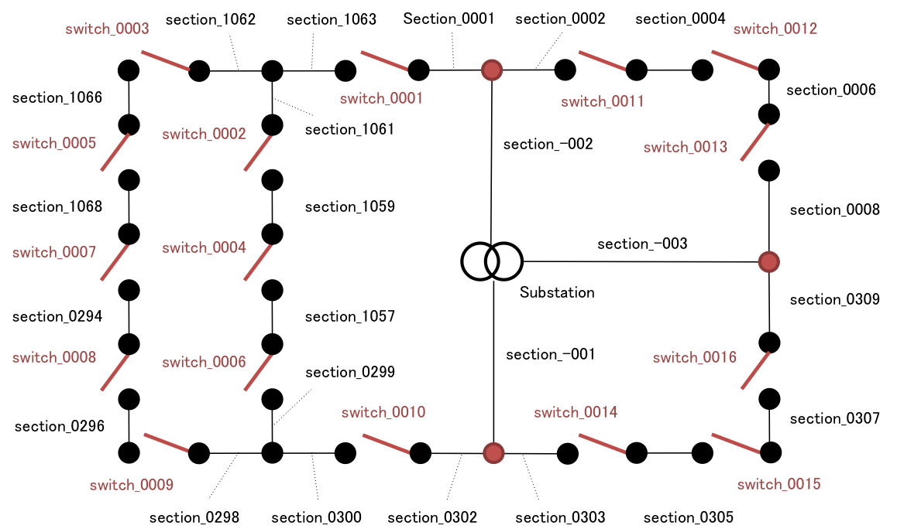

DNET - Distribution Network Evaluation Tool
=====================================================================

What's DNET
---------------------------------------------------------------------

DNET (Distribution Network Evaluation Tool) is an efficient analysis
tool that evaluates power distribution networks for power loss
minimization, service restoration, and so forth.  DNET examines all
network configurations (i.e., all combinations of switch's on-off
status in a network), and efficiently finds the best one you want.  It
is highly scalable and so it handles a network with hundreds of
switches, thanks to the use of compressive graph representation named
zero-suppressed binary decision diagram.

DNET requires distribution network data including topology (line
connectivity and switch positions), and loads and impedances for all
line sections.  DNET supports the constraints of radiality, line
capacity, and voltage drop.  Capacitor control is not cared in DNET.

DNET can be used freely under the MIT license, which is found in
`MIT-LICENSE.txt` in the DNET package.  We would really appreciate if
you would address our contribution in your paper on the use of DNET
(e.g., in Acknowledgement section in the paper).

DNET is mainly developed in [JST ERATO Minato
project](http://www-erato.ist.hokudai.ac.jp/?language=en).  It is
implemented by the authors listed in `AUTHORS.txt`, and its theory is
studied by several people as described in `doc/dnet-thoery.pdf`.

DNET is still under the development.  The current version just
supports configuration search and loss minimization, but we believe
service restoration is also possible if you can use DNET appropriately
with deep understanding of the DNET theory.  We really appreciate any
pull request and patch.

Installation
---------------------------------------------------------------------

First, we extract DNET and move into it.

```bash
$ tar fxz dnet-0.1.0.tar.gz
$ cd dnet-0.1.0/
```

Next, we resolve dependencies.  DNET requires *fukashigi*
combinatorial problem solver, and fukashigi depends on two libraries
(frontier method and binary decision diagrams).  These packages are
not yet available online (will be soon we believe), and so we include
them in `pkg/` directory in the DNET.  Install them as follows:

```bash
$ cd pkg/

$ tar fxz sapporobdd-0.1.tar.gz
$ cd sapporobdd-0.1/
$ ./configure
$ make
$ sudo make install
$ cd ../

$ tar fxz frontier-0.1.tar.gz
$ cd frontier-0.1/
$ ./configure
$ make
$ sudo make install
$ cd ../

$ tar fxz fukashigi-0.1.tar.gz
$ cd fukashigi-0.1/
$ ./configure
$ make
$ make check
$ sudo make install
$ cd ../
```

If you use a 64-bit machine, you can pass `--enable-64bit` option to
configure scripts for all the packages.

Finally, we can do tests for DNET by:

```bash
$ make check
:
ok
```

If you found "ok" at the end of test results, the installation would
have been done successfully.

Data format
---------------------------------------------------------------------

In DNET, distribution network data must be formatted following
[YAML](http://en.wikipedia.org/wiki/YAML).  Since YAML has quite
simple rules to format complicated numerical data like distribution
network, it is very easy to convert your data to DNET format; see the
example, `test/data.yaml` in the DNET package, and you understand the
rules readily.

The example data consists of three feeders and 16 switches, as shown
in the figure.



The data file, `test/data.yaml`, is divided into three parts; nodes,
sections, and switches.  

The node part describes nodes, at which a switch and/or section(s) are
connected.  In the above example network, nodes are indicated by black
or red circles.  The following data represents some nodes in the above
network; three sections are connected at the first line of the node
part (i.e., section_-001, section_0302, and section_0303), while a
section and a switch is connected at the fourth line (i.e.,
section_0302 and switch_0010).

```yaml
nodes:
- [section_-001, section_0302, section_0303]
- [section_-002, section_0001, section_0002]
- [section_-003, section_0008, section_0309]
- [section_0302, switch_0010]
```

The section part describes section information including load and
impedance.  In DNET, loads are assumed to be unbalanced three-phase
and be connected in delta.  Loads are also assumed to be uniformly
distributed along a line section, and are modeled as constant current,
not as power (see Section 2 in `doc/dnet-theory.pdf` for more detail).
In the data file, load and impedance are specified by six values,
which are real and imaginary parts of the three phases; for
section_-001 in the following example, load current is 16.3225894 +
0j in the 0-th phase, and impedance is 0.0684 + 0.3678805j in the all
phases.  Substation attribute indicates whether the line is directly
connected to a substation.  There is no restriction on section names.

```yaml
sections:
  section_-001:
    impedance: [0.0864, 0.3678805, 0.0864, 0.3678805, 0.0864, 0.3678805]
    load: [16.3225894, 0, 16.3225894, 0, 1.29105e-11, 0]
    substation: true
```

The switch part describes switch information.  Since no information is
required in the current version, just an empty curly brace is given
for each switch.  We have to be careful to assign switch numbers.
First, the numbers must be successive natural numbers (positive
integers), and they must be represented by four-figure numbers with
leading zeros (i.e., printf of "switch_%04d").  Second, switches
should be numbered based on the proximity in the network as shown in
the figure, because DNET's efficiency highly depends on the order.
Finally, in the loss minimization, the order must not step over
junctions connected to a substation (such junctions are indicated by
red circiled in the figure); see Sections 4.1 and 5.1 in
`doc/dnet-theory.pdf` for more detail.

```yaml
switches:
  switch_0001: {}
  switch_0002: {}
  switch_0003: {}
```

Optionally, switches may have original_number attribute, which is the
original switch number in your data and will be shown in the DNET's
results.

```yaml
switches:
  switch_0001: {original_number: 1064}
  switch_0002: {original_number: 1060}
  switch_0003: {original_number: 1065}
```

Data in the [Fukui-TEPCO
format](http://www.hayashilab.sci.waseda.ac.jp/RIANT/riant_test_feeder.html)
can be converted to the DNET format by `script/dnet-converter`.
Since Fukui-TEPCO format lacks switch indicators, you have to add
file `sw_list.dat` that includes switch numbers; see examples in
`test/data/`.  The data is converted as follows.

```bash
$ ./script/dnet-converter test/data > data.yaml
```

Usage
---------------------------------------------------------------------

We first enumerate all feasible configurations in the compressive
graph represesntation (don't worry, you do not have to understand the
complicated graph representation).  For the constraints of line
capacity and voltage drop, maximum current and minimum voltage must be
defined at the head of `script/dnet-enumerator`.

In this tutorial, we choose `/tmp/dnet` as the output directory, in
which result files will be placed.

```bash
$ ./script/dnet-enumerator test/data.yaml /tmp/dnet
```

You find some files in `/tmp/dnet`, and `/tmp/dnet/diagram` includes
all feasible configurations.

### Configuration search

We count the number of all the feasible configurations.

```bash
$ fukashigi -n 16 -t cardinality /tmp/dnet/diagram
111
```

The result shows that this network has 111 feasible configurations.

Next, we do random sampling; select a single feasible configuration
uniformly randomly from feasible ones.

```bash
$ fukashigi -n 16 -t 1 /tmp/dnet/diagram 
1 3 4 5 6 8 9 10 11 12 14 16 
```

The result shows a list of switch numbers that are closed in the
configuration (your result may be different depending on random number
generators).

We retrieve configurations by issuing a query; e.g., switch-1 to
switch-5 are closed, while switch-9 *or* switch-10 is open.

```bash
$ echo "1 2 3 4 5" > closed
$ echo "9 10" > open
$ fukashigi -n 16 -t e /tmp/dnet/diagram "/" closed "%" open
7 8 10 12 13 14 15
7 8 10 12 13 14 16
7 8 10 12 13 15 16
```

The result shows three configurations that meet the query; note that
closed switches in the query (switch-1 to switch-5) are omitted in the
result.

Finally, we can calculate power loss of a given confiugration.

```bash
$ ./script/dnet-loss test/data.yaml -c 1 3 4 5 6 8 9 10 11 12 14 16
74285.5
```

### Power loss minimization

We search for the minimum loss configuration from all feasible
configurations enumerated abolve.

```bash
$ ./script/dnet-optimizer test/data.yaml test/diagram
minimum_loss: 72055.7
loss_without_root_sections: 47781.7
lower_bound_of_minimum_loss: 69238.4
open_switches: ['switch_0004', 'switch_0007', 'switch_0012', 'switch_0015']
```

The minimum loss is 72055.7 and the lower bound is 69238.4; the lower
bound is theoretical bound under which the minimum loss never be (see
Section 3.3 in `doc/dnet-theory.pdf` in detail).  In the optimal
configuration, switch-4, switch-7, switch-12, and switch-15 are open.

Limitations
---------------------------------------------------------------------

DNET assumes that just switches are controllable, and other components
like capacitors are ignored.

Section loads are given as constant current, and must not be negative.
This can be an issue if introducing distributed generators; see
Sections 4.1 and 8 in `doc/dnet-theory.pdf` for more detail.

In the loss minimization, switches between a substation and a junction
are assumed to be closed; see Section 4.1 in `doc/dnet-theory.pdf` for
more detail.

References
---------------------------------------------------------------------

Takeru Inoue, "Theory of Distribution Network Evaluation Tool,"
`doc/dnet-theory.pdf`.

Takeru Inoue, Keiji Takano, Takayuki Watanabe, Jun Kawahara, Ryo
Yoshinaka, Akihiro Kishimoto, Koji Tsuda, Shin-ichi Minato, and
Yasuhiro Hayashi, "Loss Minimization of Power Distribution Networks
with Guaranteed Error Bound," Hokkaido University, Division of
Computer Science, TCS Technical Reports, TCS-TR-A-12-59, August 2012.
([pdf](http://www-alg.ist.hokudai.ac.jp/~thomas/TCSTR/tcstr_12_59/tcstr_12_59.pdf))
